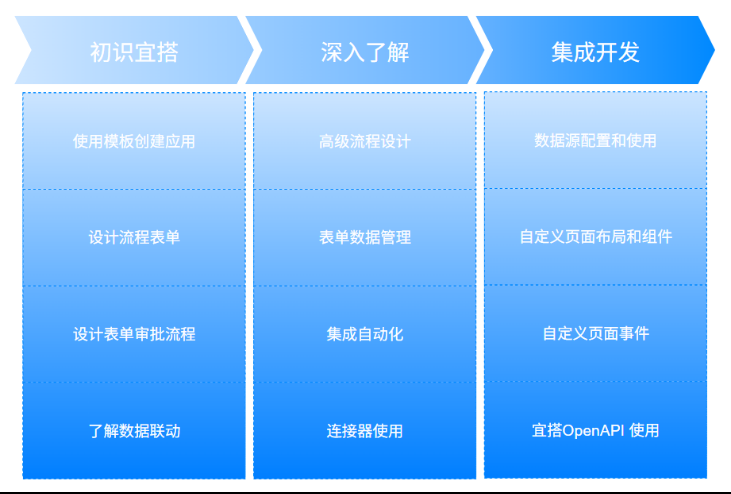

## Code Workshop for App

1. 创建项目

## Yida Platform

宜达学习路线图

1. 宜搭平台能力
   * 表单
   * 流程
   * 报表
   * 集成自动化
   * AI
   * 钉融合（易连接、强拓展、酷应用）
2. 宜搭页面类型
   * 普通表单
   * 流程表单
   * 聚合表
   * 报表
   * 可播报门户
   * 数字化大屏
   * 自定义页面
   * 外部连接
3. 宜搭表单管理
   * 表单设计
     * 表单基础信息
     * 新建表单
     * 字段属性
     * 常用字段
     * 高级字段
   * 表单自定义
     * 组件管理
     * 组件分发
     * 组件属性
     * 组件调试
   * 表单页面设置
     * 基础设置
     * 自定义详情页
     * 自定义按钮
     * 表单的消息通知
     * 页面发布
     * 打印设置
     * 关联列表
     * 权限设置
     * 二维码标签
     * 表单布局
     * 流水号
     * 修改提交后的表单
   * 表单属性
     * 表单业务规则
     * 表单校验
   * 表单数据管理 
     * 生成数据管理
     * 数据管理页权限
     * 设置显示列字段
     * 设置参与筛选字段
     * 自定义按钮
     * 下载二维码标签
     * 设置筛选条件
     * 批量导入、导出、修改、删除、打印、发起、导入增强
     * 按导入批次删除、操作记录查询
     * 批量删除数据风险提示
     * 支持草稿、支持多视图
4. 宜搭流程设计 
   * 流程节点介绍
     * 发起节点
     * 人工节点
     * 分支节点
     * 消息节点
     * 卡片节点
     * 数据节点
     * 脚本节点
   * 流程属性设置
     * 流程版本控制
     * 权限设置
     * 字段审批规则
     * 超时处理规则
     * 节点提交规则
     * 手动签名
   * 流程使用
     * 审批评论
     * 流程预览
     * 流程分析
     * 流程中心
     * 高级流程
5. 集成自动化
   * 创建集成&自动化
     * 触发类型
     * 顺序执行
   * 配置集成&自动化
     * 数据节点（新增、更新、获取、删除）
     * 人工节点
     * 消息节点（邮件、消息）
     * 卡片节点
     * 分支节点（条件、并行、循环容器）
     * 连接器节点（官方连接器、自定义连接器）
     * 脚本节点
     * 运行日志
   * 异常消息提醒
6. 门户设计
   * 门户设计
   * 门户组件
   * 页面设置
7. 报表设计
   * 报表设计
   * 报表组件
   * 字段设置
8. 自定义页面
   * 创建自定义页面
   * 自定义页面设置
   * 自定义页面设计器
     * 设计器简介（区块模板、条件渲染、循环渲染、渲染唯一标识）
     * 自定义页面组件
9. 酷应用
   * 创建酷应用
   * 酷卡片设计
   * 酷流程设计
   * 酷卡片发布
   * 酷卡片启用
   * 酷SaaS工厂
10. 平台管理
    * 账号授权管理
    * 平台权限管理
    * 宜搭角色管理（角色组、角色、接口人）
    * 权限矩阵
    * 连接器工厂（HTTP连接器、FaaS连接器）
    * 邮箱管理
    * 消息通知模板
11. 应用管理
    * 创建应用
    * 应用排序
    * 页面管理
    * 应用设置
      * 应用基础设置
      * 应用权限设置
      * 应用启动和停用
      * 获取应用链接
      * 自定义应用访问地址
    * 应用发布
12. AI助理
13. 插件中心
14. 国际化
15. 开发者功能

### 注意点：
1. 普通表单和流程表单
   **区别就是流程表单需要逐级审批，且需要设置流程**
2. 发送卡片节点配置
   > 配置流程：
   > 1）选择要发送/更新的卡片 
   > 2）将数据绑定到卡片上 
   > 3）配置卡片按钮/链接的动作行为 
   > 4）确定发送范围及规则

